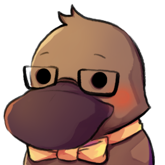

<!-- PROJECT LOGO -->
<br />
<p align="center">
  <a href="https://github.com/stefanleminh/ploot">
    
  </a>
  <h3 align="center">Ploot</h3>
  <p align="center">
    A bot to help you with your team-building needs in PvP games!
    <br />
    <a href="https://github.com/stefanleminh/ploot/issues">Report Bug</a>
    ·
    <a href="https://github.com/stefanleminh/ploot/issues">Request Feature</a>
  </p>
</p>

<!-- TABLE OF CONTENTS -->
<details open="open">
  <summary>Table of Contents</summary>
  <ol>
    <li>
      <a href="#about-the-project">About The Project</a>
    </li>
    <li>
      <a href="#getting-started">Getting Started</a>
      <ul>
        <li><a href="#prerequisites">Prerequisites</a></li>
        <li><a href="#installation">Installation</a></li>
      </ul>
    </li>
    <li><a href="#usage">Usage</a></li>
    <li><a href="#roadmap">Roadmap</a></li>
    <li><a href="#contributing">Contributing</a></li>
    <li><a href="#license">License</a></li>
    <li><a href="#credits">Credits</a></li>
  </ol>
</details>

<!-- ABOUT THE PROJECT -->

## About The Project

Ploot will help you create breakout-sessions (that you can use for gaming for example) in your discord server. You can add, remove players or spectators, randomize two teams of 6 people and move them into designated voice channels when you start/end the match.
No more using randomize websites and moving each player back and forth one by one!

<!-- GETTING STARTED -->

## Getting Started

This is an example of how you may give instructions on setting up your project locally.
To get a local copy up and running follow these simple example steps.

### Prerequisites

This is an example of how to list things you need to use the software and how to install them.

- npm
  ```sh
  npm install npm@latest -g
  ```

### Installation

1. Clone the repo
   ```sh
   git clone https://github.com/stefanleminh/ploot.git
   ```
2. Install NPM packages
   ```sh
   npm install
   ```
3. Enter your configuration in `config.json` (refer to [Configuration](#configuration))
4. Run with

   ```sh
   npm run start
   ```

#### Configuration

You have to create a config.json file in the root directory. It will need the following properties:

```json
{
  "token": "", // Bot-Token
  "loggingLevel": "info", // Logging-Level
  "testGuildId": "" // Server-ID to employ commands on guild-level (will deploy globally if empty)
}
```

<!-- USAGE EXAMPLES -->

## Usage

1. Configure the bot with `/configure`. Currently you will have to set the lobby VC, first team's VC and second team's VC.
1. Start a new session with `/newsession` - Ploot will now create roles for spectators and the teams that are pre-configured in the config.
   - Any player in the lobby will be a player unless you specifically give them the spectator role, either manually or via the `/switchmode` command.
1. You can then create your teams by using the `/randomize` command - It will ignore bots and only look at the members connected to the lobby-vc.
1. Then you can use `/startmatch` to move every player in the lobby to their designated voice-channel and back to the lobby with `/endmatch`.
1. Finally, you can end the session with `/endsession`.

|             | Arguments    | Description                                                        |
| ----------- | ------------ | ------------------------------------------------------------------ |
| /help       |              | Shows the help message                                             |
| /configure  |              | Configures the bot                                                 |
| /newsession |              | Creates a new session and roles with the preconfigured channels.   |
| /endsession |              | Ends the session and clears all the data.                          |
| /startmatch |              | Moves the users to the designated team channels.                   |
| /endmatch   |              | Moves the users back to the lobby.                                 |
| /list       |              | Lists active players and spectators.                               |  |
| /switchmode | @DiscordUser | Switches the player from active player to spectator or vice versa. |
| /randomize  |              | Randomizes and shows the new teams.                                |
| /clear      |              | Clears active players and spectators list.                         |

<!-- ROADMAP -->

## Roadmap

See the [open issues](https://github.com/stefanleminh/ploot/issues) for a list of proposed features (and known issues).

<!-- CONTRIBUTING -->

## Contributing

Contributions are what make the open source community such an amazing place to be learn, inspire, and create. Any contributions you make are **greatly appreciated**.

1. Fork the Project
2. Create your Feature Branch (`git checkout -b feature/AmazingFeature`)
3. Commit your Changes (`git commit -m 'Add some AmazingFeature'`)
4. Push to the Branch (`git push origin feature/AmazingFeature`)
5. Open a Pull Request

<!-- LICENSE -->

## License

Distributed under the MIT License. See `LICENSE` for more information.

<!-- ACKNOWLEDGEMENTS -->

## Credits

- [Icon artist](https://twitter.com/mizururu_)
